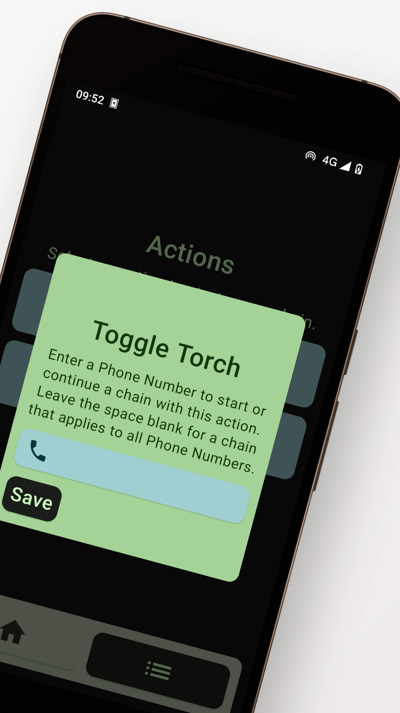

# Method Call

Automate your Android with phone calls.

Built with Jetpack Compose

## Features
- Persistent i.e.: application can be killed or phone restarted and would not stop your automations.

## Actions
- Launch an app
- Toggle flashlight

## Screenshots

## Feedback/Contributions
- Open to suggestions and feedback
